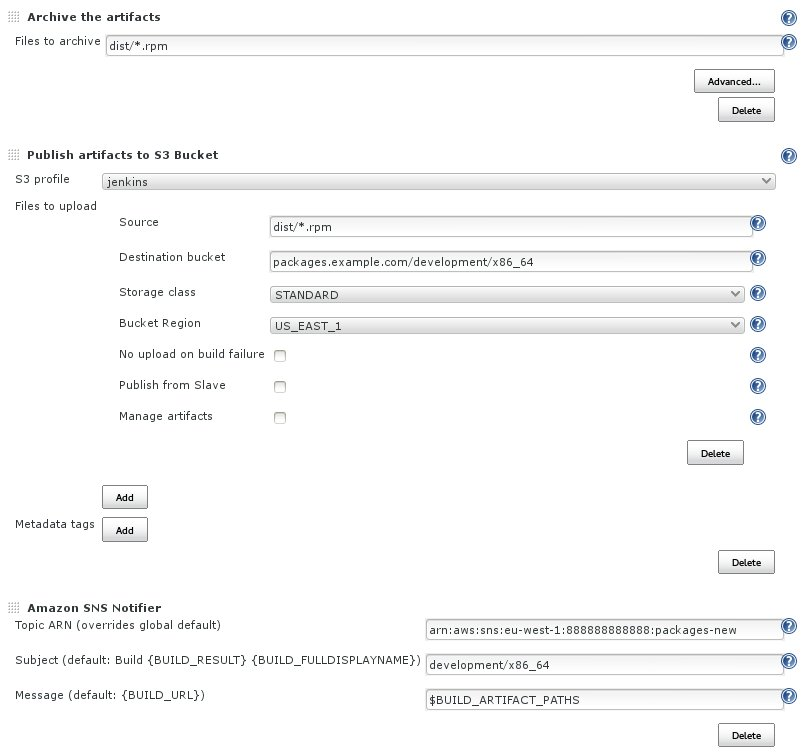

## Jenkins Plugins

You will need to install the
[S3 Plugin](https://wiki.jenkins-ci.org/display/JENKINS/S3+Plugin)
to upload the rpm artifacts from a successful build to S3 and
[SNS Notifier](https://wiki.jenkins-ci.org/display/JENKINS/Amazon+SNS+Notifier)
to notify `repoupdate-daemon` about the new rpm files.

Next go to the "Configure System" screen on Jenkins and under "Amazon S3 profiles"
add a new profile with credentials which have permission to put objects on your
packages bucket. Under "Amazon SNS Notification" specify credentials which can
publish to your SNS topic.

See `PackagePublishGroup` policy in [cloudformation.json](cloudformation.json)
for required permissions.

## Configure Job

On the Jenkins job that builds the rpms you wish to publish you will need to
add 3 post-build actions.

### Archive the artifacts

Specify the pattern to match the rpm files created by the build, e.g. `dist/*.rpm`.

### Publish artifacts to S3 Bucket

Select the S3 profile created earlier and specify both the "Source" and "Destination
bucket".  The value for "Source" should match the archive pattern set in the previous
action, e.g. `dist/*.rpm`.  The "Destination" should include both the bucket name and
the base path for the target repository, e.g. `packages.example.com/development/x86_64`.

### Amazon SNS Notifier

Use the same topic `repoupdate-daemon` is subscribed to. The SNS subject should
specify the repository base path where the rpm was published, e.g. `development/x86_64`.
For "Message" use `$BUILD_ARTIFACT_PATHS`, which will evaluate to the list of rpm
files matched by the "Archive" action.

